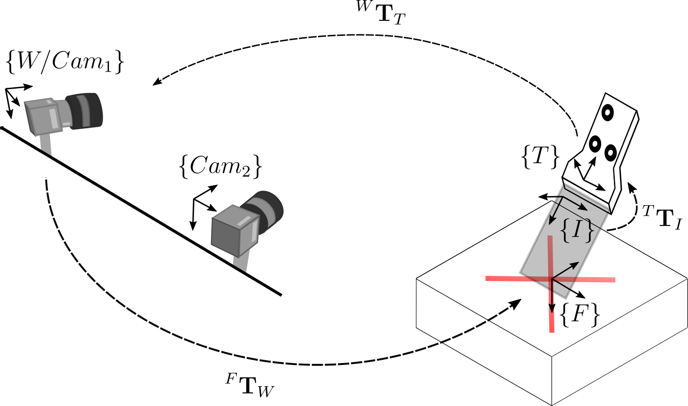
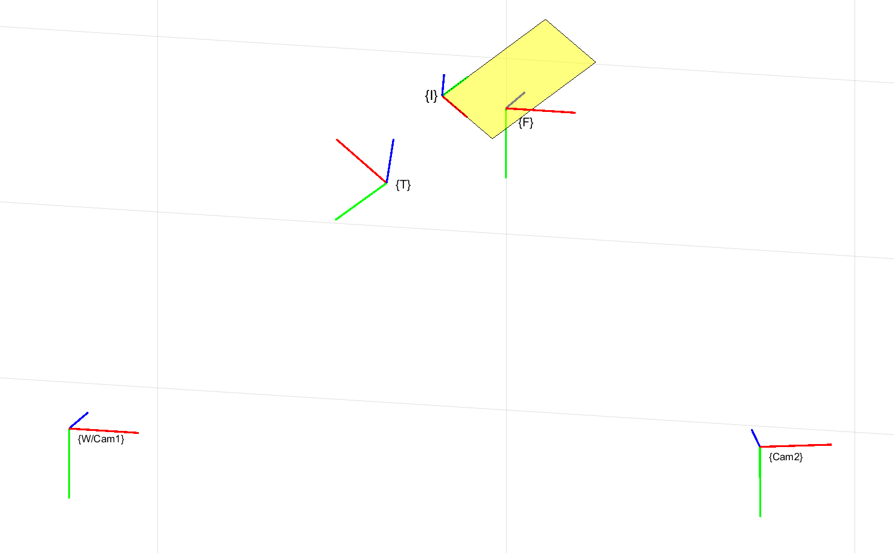

# Freehand Ultrasound Calibration

Calibration of a 3D freehand ultrasound system composed of a stereo vision system of two conventional cameras, and a marker of three circles attached to the ultrasound probe, using a cross-wire phatom. The code for acquisition is available [here](https://github.com/jhacsonmeza/StereoBaslerUltrasound), where the stereo vision cameras and the ultrasound images are acquired simultaneously. A figure of the system and the coordinate frames involved in the calibration process is shown below.

    

where {Cam1} is also the (global) world {W} coordinate system. {Cam2} is the second camera, {T} is the target or transducer frame, {I} is the ultrasound image coordinate system, and {F} is the cross-wire phantom coordinate frame. The figure also shows the transformation matrices involved in the calibration.

## Calibration process

The calibration process can be carried out with the following three snippets of code:
* `ProbePose.py`: a snippet of code for pose estimation of the target attached to the ultrasound probe. Stereo calibration parameters and the images of both cameras are required. As output, we have a file `target_pose.npy` with the nx4x4 transformation of the n frames from the Target {T} coordinate system to the (left camera) World {W} system.

* `PointSegment.py`: manual segmentation of the cross point in the ultrasound images. You can select the point with the right-click. As input, you need the ultrasound images, and the output is a file `cross_point.npy` with an nx2 array with all the n selected center locations.

* `UScalib.py`: the calibration process is carried out here. For this, we need more than one dataset. With more than one dataset we can evaluate the reproducibility and assure a good quality of the calibration. As input we need the size of the ultrasound image in pixel, in addition to the `target_pose.npy` and `cross_point.npy` generated with the last two snippets of code. The output is a `report.txt` with the calibration reproducibility measured in 5 points of the ultrasound image (4 corners and center). Finally, a file `USparams.npz` with x and y scales factors of the ultrasound image and the transformation matrix from the ultrasound image {I} to the target {T} coordinate system.

In addition to the above, `target.py` contains different functions for target detection and pose estimations. Furthermore `calibration.py` contains the `Calibration` class which handles the calibration procedure. If your calibration was done with Matlab, you can use `create_calib_params.m` to edit calibration variables to be used correctly for target pose estimation.

## Usage example

Some important information for the calibration can be set in the `config.yaml` file. Here, the path of calibration dataset have to be specified. Also, we need to specify the folder name for the right images, left images, and US images that are supposed to be in the dataset path. Finally, the stereo calibration parameters file name and the ultrasound image size in pixels have to be set.

* Clone this repository: `git clone https://github.com/jhacsonmeza/US-Calibration.git`
* Download the calibration [dataset example](https://drive.google.com/drive/folders/1E0zDVzpZ2zJhMnnxYgoIrWsO7RwUDwSH?usp=sharing). Note that the current parameters in `config.yaml` are adapted to this dataset.
* Run `python ProbePose.py` for target/transducer pose estimation.
* `python PointSegment.py` to segment the cross-wire points manually.
* `python UScalib.py` for estimate the freehand ultrasound parameters.

In the following image, an example of the recosntructed coordinate systems involved in the calibration is shown.

    

